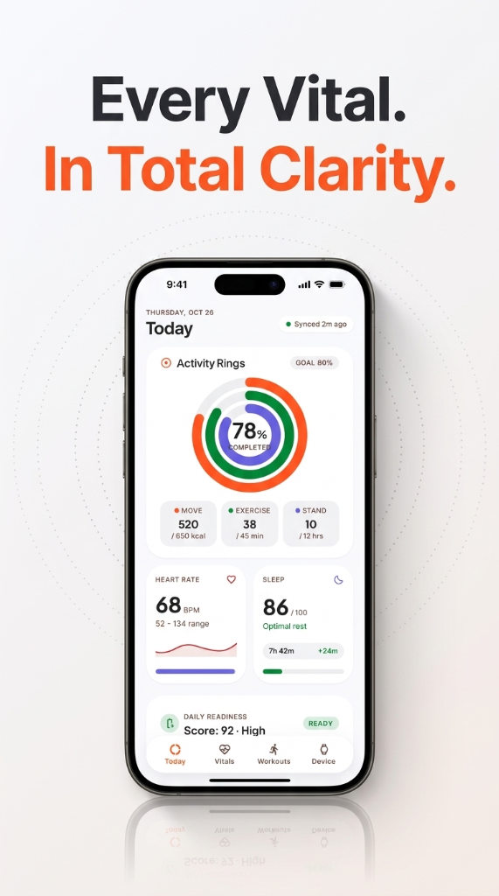
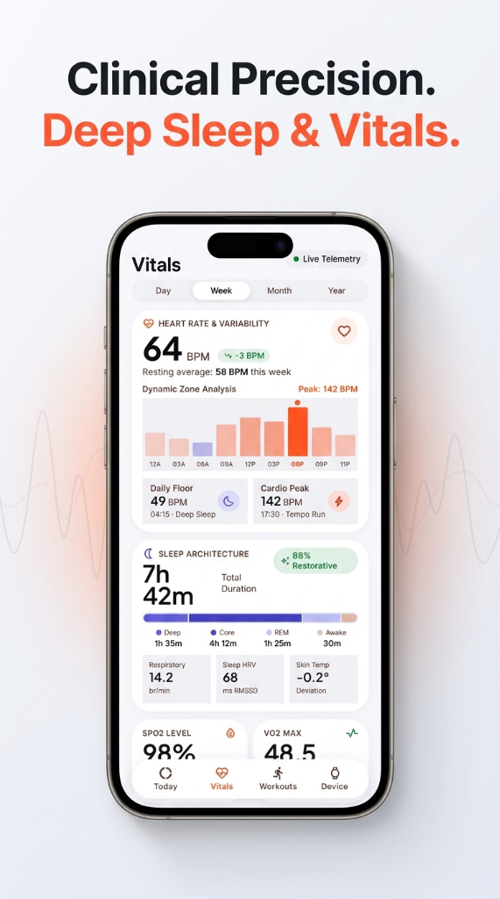
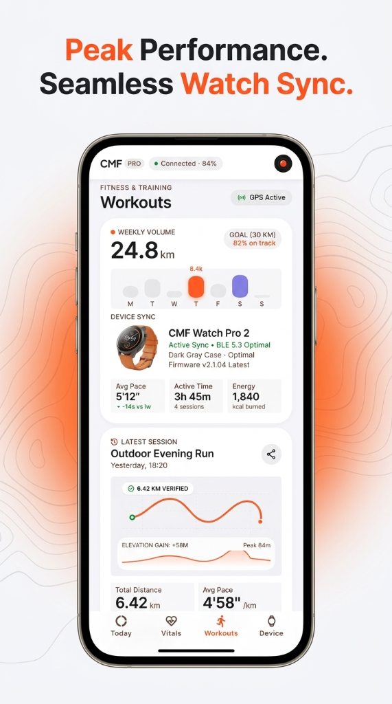

# ⌚ CMF Watch Client & Companion Ecosystem

[](android/)
[](android/)
[](cmf_watch_client/)
[](LICENSE)

An open-source, offline-first companion application and reverse-engineered BLE protocol client for **CMF by Nothing** smartwatches (**CMF Watch Pro 2**, **CMF Watch Pro**, and **CMF Watch 3 Pro**).

This project provides a complete ecosystem: a **native Android companion app** with a clean, clinical light-themed interface, and a **production-grade Python BLE driver & CLI** for direct local pairing, binary telemetry decoding, and cloud-free health data management.

---

## 📱 Screenshots

<p align="center">
  
  &nbsp;
  
  &nbsp;
  
</p>

---

## 🌟 Key Features

### 📱 Native Android Companion App (`android/`)
- **Clinical Light Design System**: Clean off-white canvas with card-based surfaces, custom typography (Plus Jakarta Sans & Inter), and high-visibility status indicators.
- **Activity Rings & Today View**: Real-time tracking of Move, Exercise, and Stand goals, Heart Rate (BPM), Sleep summary, and Daily Readiness scoring (e.g. 92 High).
- **Clinical Vitals & Sleep Architecture**: Deep analysis of sleep stages (Deep, Core, REM, Awake), Sleep HRV (ms RMSSD), Respiratory rate, Skin temperature deviation, SpO₂ saturation, and VO₂ Max.
- **Heart Rate & Variability Analysis**: Daily resting average, Dynamic Zone Analysis bar charts, Daily Floor, and Cardio Peak detection.
- **Workouts & GPS Route Maps**: Weekly training volume, active session telemetry (pace, calories burned, duration), and verified outdoor run maps with elevation profiles.
- **Device Management & BLE Sync**: Real-time CMF Watch Pro 2 BLE 5.3 connection status, firmware version, battery telemetry, haptic settings, and Find My Watch integration.
- **Offline & Private**: Local-first storage powered by Android Room SQLite—zero mandatory cloud sync or third-party data tracking.

### 🐍 Python BLE Client & Protocol Engine (`cmf_watch_client/`)
- **Direct GATT BLE Driver**: Local communication over custom GATT services via `Bleak`.
- **First-Time Pairing**: Automated shell AT channel challenge exchange (`AT GETSECRET`) and long-term `authkey` derivation (`SHA256`).
- **AES-128-CBC Encryption**: Dynamic `sessionKey` derivation, fixed IV cipher, CRC32 verification, and `0xF5` 11-byte frame reassembly.
- **Binary Telemetry Decoders**: Normalizes raw byte streams into verified **Pydantic v2** models for steps, heart rate, sleep, SpO₂, stress, and workout sessions.
- **Command Line Utility**: CLI tools (`cmf-watch-client scan / pair / sync`) for easy terminal workflow and background scripting.

---

## ⌚ Supported Watch Models

| Device Model | Advertised Name Filter | Status | MCU / Platform |
|---|---|---|---|
| **CMF Watch Pro 2** | `CMF Watch Pro 2-XXXX` | **CONFIRMED (FULL SUPPORT)** | Actions Semi ATS3089C |
| **CMF Watch Pro** | `Watch Pro` | **CONFIRMED (FULL SUPPORT)** | Actions Semi ATS3085 |
| **CMF Watch 3 Pro** | `CMF Watch 3 Pro` | **SUPPORTED (Protocol Compatible)** | Actions Semi ATS3089C |

---

## 🏗 Project Architecture

```text
 ┌─────────────────────────────────────────────────────────────────────────────┐
 │                    PYTHON CMF WATCH CLIENT (cmf_watch_client)              │
 │  - Primary Protocol Source of Truth & Reverse-Engineering Engine           │
 │  - Asynchronous Bleak GATT Client, Decoders, CLI & Experiment Recorder     │
 └──────────────────────────────────────┬──────────────────────────────────────┘
                                        │
                         Shared Protocol Specification
                                        │
 ┌──────────────────────────────────────▼──────────────────────────────────────┐
 │                     ANDROID COMPANION APPLICATION (android/)                │
 │  - Consumer Companion App & Background Telemetry Sync Host                  │
 │  - Native Android BluetoothGatt, Room SQLite DB, Jetpack Compose UI        │
 └─────────────────────────────────────────────────────────────────────────────┘
```

For detailed architectural specifications and design standards, see:
- 📄 [System Architecture Specification](docs/ARCHITECTURE.md)
- 📄 [Android App Specifications](docs/app/ARCHITECTURE.md)

---

## 🚀 Getting Started

### 📱 Running the Android Companion App

The Android app source is located in the [`android/`](android/) directory.

#### Prerequisites
- JDK 17+
- Android SDK (API level 36 target, minimum API 26 / Android 8.0)

#### Build and Install
```bash
cd android
./gradlew assembleDebug
```
The compiled APK will be generated at `android/app/build/outputs/apk/debug/app-debug.apk`.

---

### 🐍 Using the Python Client & CLI

The Python package is located in the root / [`cmf_watch_client/`](cmf_watch_client/) directory.

#### Installation
```bash
git clone https://github.com/ArunaK-netizen/cmf_watch_client.git
cd cmf_watch_client
pip install -e .
```

For development & testing:
```bash
pip install -e ".[dev]"
```

#### CLI Quickstart

1. **Scan for Watch**:
   ```bash
   cmf-watch-client scan
   ```
2. **Pair & Derive Auth Keys**:
   ```bash
   cmf-watch-client pair
   ```
3. **Sync Health Telemetry**:
   ```bash
   cmf-watch-client sync --out health_sync_latest.json
   ```

#### Python API Example

```python
import asyncio
from cmf_watch_client import CmfWatchClient, JSONStorageExporter

async def main():
    mac_address = "3C:B0:ED:3F:BA:70"
    authkey_bytes = bytes.fromhex("cc78921a307df9095405f67d0132a7f4")

    # 1. Initialize Client
    client = CmfWatchClient(mac_address, authkey=authkey_bytes)
    
    # 2. Connect & Authenticate Session
    await client.connect()
    await client.authenticate_session()

    # 3. Fetch Battery State
    battery_level, is_charging = await client.fetch_battery()
    print(f"Watch Battery: {battery_level}% (Charging: {is_charging})")

    # 4. Synchronize Health Telemetry
    telemetry = await client.sync_health_data(timeout=20.0)

    # 5. Process Metrics
    print(f"Decoded {len(telemetry['activity'])} activity interval samples.")
    print(f"Decoded {len(telemetry['heart_rate'])} heart rate samples.")
    print(f"Decoded {len(telemetry['sleep'])} sleep sessions.")

    # 6. Export Data
    exporter = JSONStorageExporter("latest_health_export.json")
    exporter.export(telemetry, {"mac_address": mac_address, "battery_level": battery_level})

    await client.disconnect()

if __name__ == "__main__":
    asyncio.run(main())
```

---

## 🛠 Reverse Engineering Specifications

Complete documentation on protocol reverse engineering and hardware packet structures:

- 📖 [GATT Protocol & Pairing Spec](docs/protocol-spec.md)
- 📖 [Packets & Opcode Registry](docs/packets-and-opcodes.md)
- 📖 [Crypto & Cipher Spec](docs/crypto-spec.md)
- 📖 [Health Telemetry Decoders Spec](docs/health-decoders-spec.md)
- 📖 [APK Reverse-Engineering Notes](docs/apk-reversing-notes.md)

---

## 🧪 Testing

Run automated tests for protocol framing, cryptography, decoders, and storage exporters:

```bash
pytest tests/
```

---

## 🔒 Security & Privacy

- **100% Local Processing**: No personal data or health telemetry is uploaded to external third-party servers.
- **Sanitized Repositories**: Credentials, tokens, and hardware MAC addresses are kept out of git history.
- See [SECURITY.md](SECURITY.md) for vulnerability reporting and security policies.

---

## 📄 License

Distributed under the [MIT License](LICENSE).
