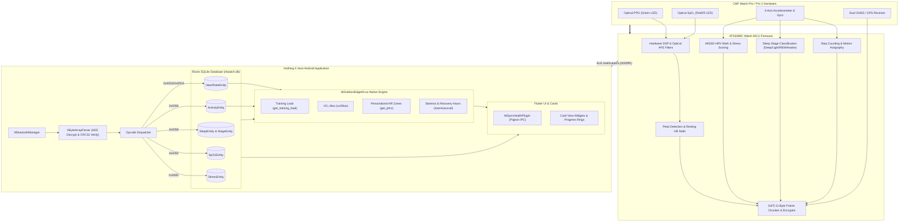

# Complete End-to-End System Architecture Diagram

```mermaid
flowchart TD
    subgraph HARDWARE [" CMF Watch Pro / Pro 2 Hardware "]
        PPG["Optical PPG (Green LED)"]
        SPO2_SENS["Optical SpO₂ (Red/IR LED)"]
        IMU["3-Axis Accelerometer & Gyro"]
        GPS_HW["Dual GNSS / GPS Receiver"]
    end

    subgraph MCU [" ATS3089C Watch MCU Firmware "]
        DSP["Hardware DSP & Optical AFE Filters"]
        ACT_ALG["Step Counting & Motion Actigraphy"]
        HR_ALG["Peak Detection & Resting HR Math"]
        SLEEP_ALG["Sleep Stage Classification (Deep/Light/REM/Awake)"]
        STRESS_ALG["rMSSD HRV Math & Stress Scoring"]
        FRAMER["0xF5 11-Byte Frame Chunker & Encryptor"]
        
        PPG --> DSP --> HR_ALG
        SPO2_SENS --> DSP
        IMU --> ACT_ALG & SLEEP_ALG & STRESS_ALG
        GPS_HW --> FRAMER
        ACT_ALG --> FRAMER
        HR_ALG --> FRAMER
        SLEEP_ALG --> FRAMER
        STRESS_ALG --> FRAMER
    end

    HARDWARE ==> MCU

    MCU == "BLE Notifications (0000fff1)" ==> APP

    subgraph APP [" Nothing X Host Android Application "]
        XBM["XBluetoothManager"]
        XBP["XByteArrayParser (AES Decrypt & CRC32 Verify)"]
        DISP["Opcode Dispatcher"]
        
        XBM --> XBP --> DISP
        
        subgraph DB [" Room SQLite Database (ntwatch.db) "]
            ACT_DB[("ActivityEntity")]
            HR_DB[("HeartRateEntity")]
            SLEEP_DB[("SleepEntity & StageEntity")]
            SPO2_DB[("SpO2Entity")]
            STRESS_DB[("StressEntity")]
        end
        
        DISP -- "0x0056" --> ACT_DB
        DISP -- "0x0053/0x00DA" --> HR_DB
        DISP -- "0x0058" --> SLEEP_DB
        DISP -- "0x0055" --> SPO2_DB
        DISP -- "0x009D" --> STRESS_DB

        subgraph GOMORE [" libGoMoreEdgeKit.so Native Engine "]
            TRIMP["Training Load (get_training_load)"]
            VO2["VO₂ Max (vo2Max)"]
            HRZ["Personalized HR Zones (get_phrz)"]
            STAMINA["Stamina & Recovery Hours (staminaLevel)"]
        end

        HR_DB & ACT_DB & DB --> GOMORE

        subgraph UI [" Flutter UI & Cards "]
            FLUTTER["NtSyncHealthPlugin (Pigeon IPC)"]
            CARDS["Card View Widgets & Progress Rings"]
        end

        GOMORE --> UI
        DB --> UI
    end
```
